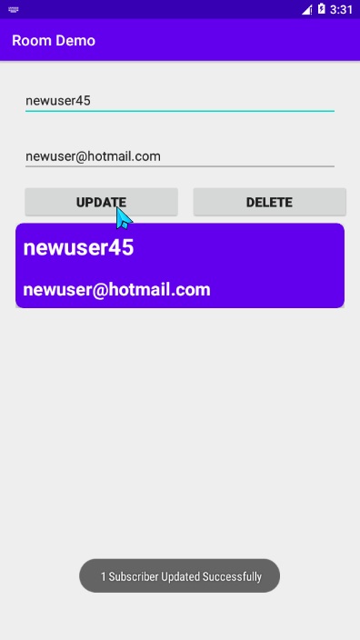
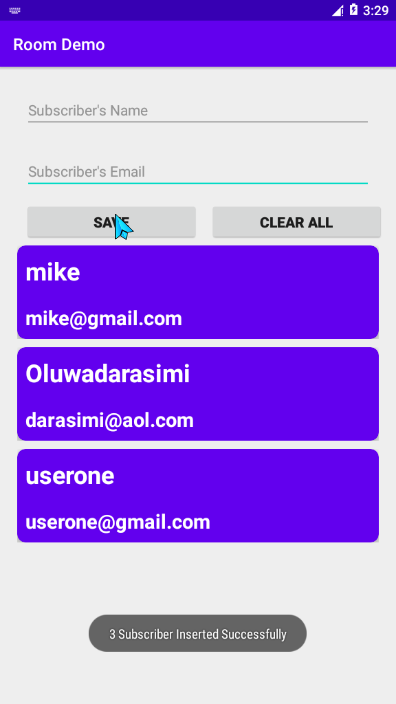
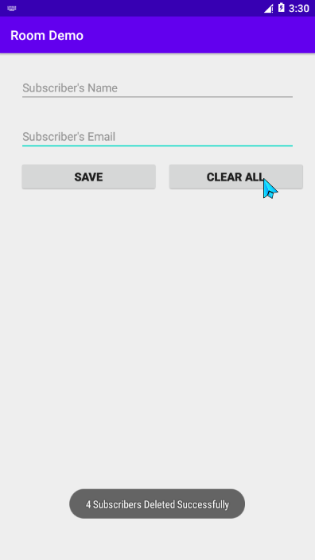
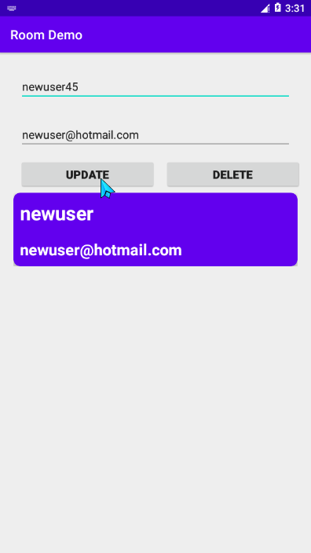

# M-V-V-M CRUD-APP

## A Simple Subscriber App

This project utilize the Model-View View-Model Architecture.

**Features**

- Coroutines
- ROOM DB
- Entity class
- DAO (Data Access Object)
- Repository
- ViewModelFactory
- ViewModel
- MutableLiveData
- LiveData
- Activity

Screenshots

