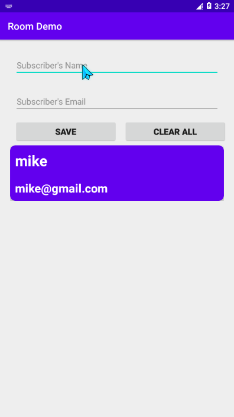

# M-V-V-M CRUD-APP

## A Simple Subscriber App

This project utilize the Model-View View-Model Architecture.

## Features

- Coroutines
- ROOM DB
- Entity class
- DAO (Data Access Object)
- Repository
- ViewModelFactory
- ViewModel
- MutableLiveData
- LiveData
- Activity

## Libraries
- [Kotlin Coroutines](https://github.com/Kotlin/kotlinx.coroutines)
- [ViewModel](https://developer.android.com/topic/libraries/architecture/viewmodel)
- [Lifecycle](https://developer.android.com/jetpack/androidx/releases/lifecycle)
- [Room](https://developer.android.com/jetpack/androidx/releases/room)

### License

This project is licensed under the Apache License 2.0 - See: http://www.apache.org/licenses/LICENSE-2.0.txt